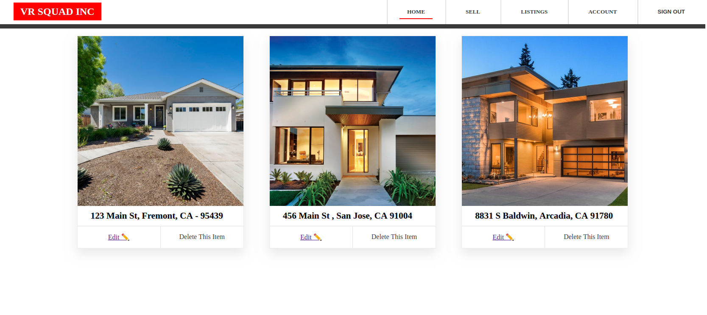
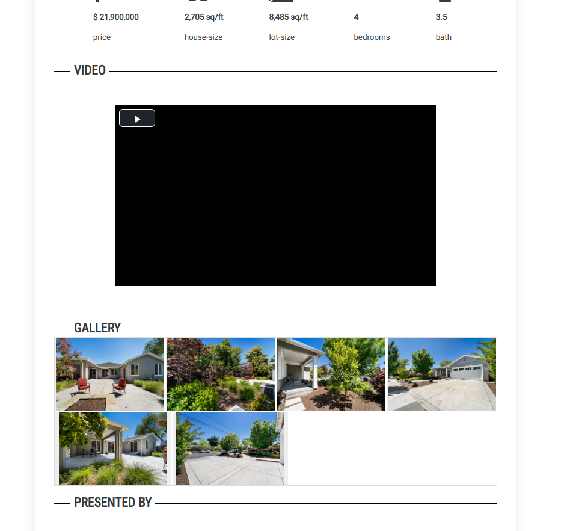
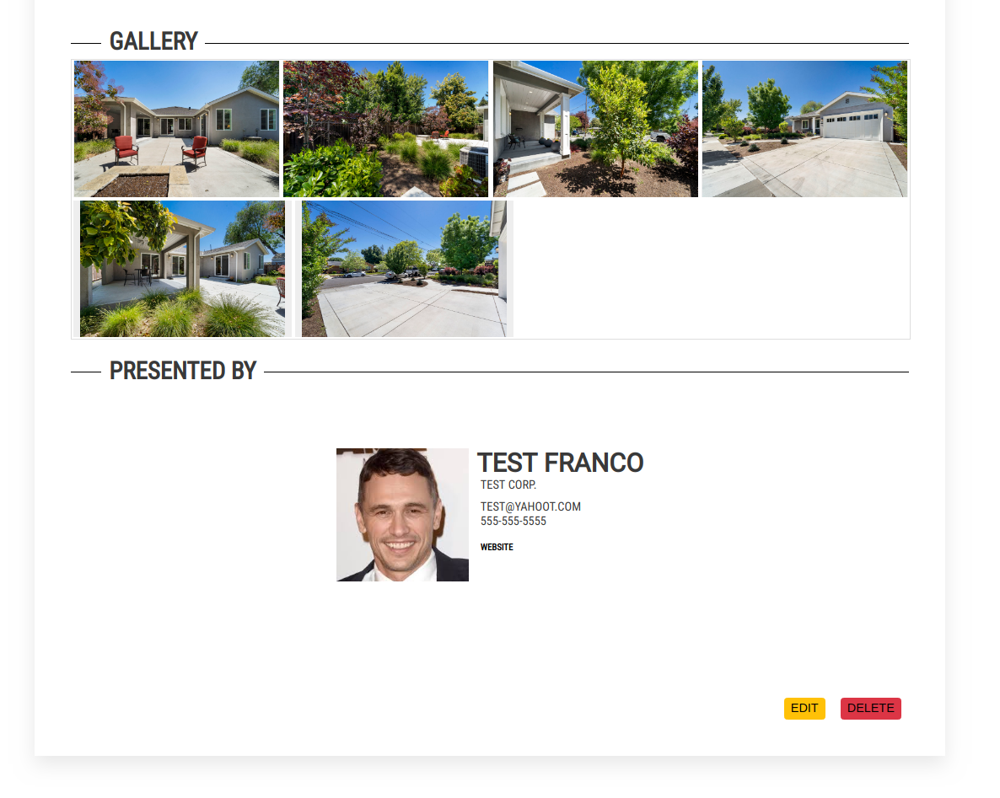
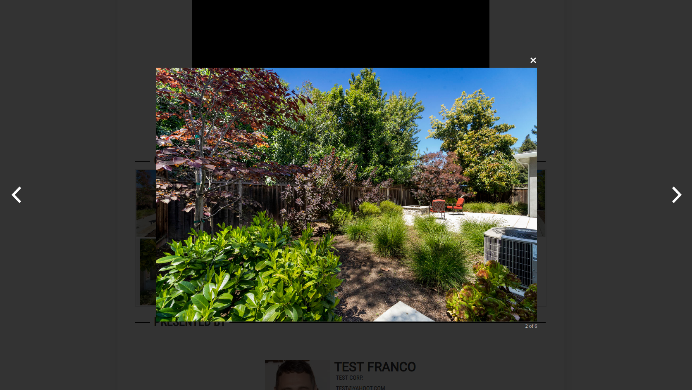

## Real-Estate Content Mangement System (CMS)

A content mangement system created with React, GraphQL, Apollo-Client, GraphQL Yoga Server, and with a Prisma hosted PostgreSQL
database.

## Features
* Ability to log in and create Real-Estate listings
* Agent profile creation, allowing you to customize your online account
* Edit your listings to change information on house 
* Delete listings you no longer need
* Request password reset if you forget via JWT

## Screenshots
![image](./screen-shots/cms-2.png

##

## To Be Implemented
* Fix mailing service that mails back webtokens
* Fix Google Static Map API
* Generate static web page using Next 

